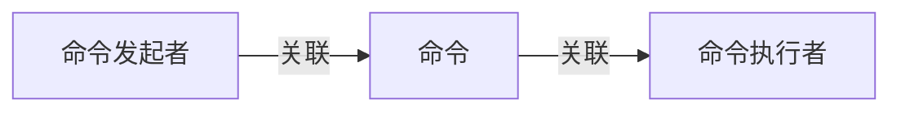
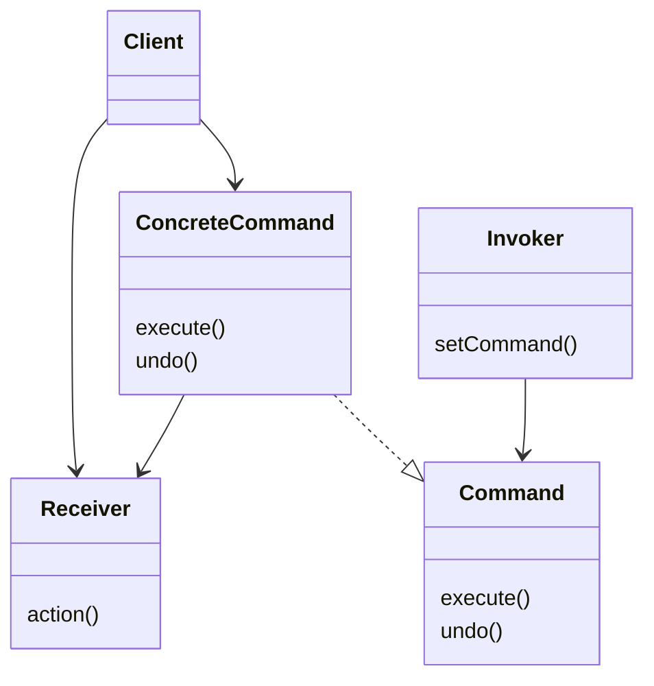

> 设计模式
> 
> [练习实例仓库](https://github.com/EMOSAMA/DesignPatternTry)
> 
> [EMO's Blog](https://emosama.github.io/)
> 
# 命令模式
> **定义：**<br>
命令模式将“请求”封装成对象，以便使用不同的请求、队列或者日志来参数化其他对象。命令模式也支持可撤销的操作

> **Hint Point：**
> - 在命令模式中我们将把方法调用封装起来
> - 命令模式将*动作的请求者*从*对象的执行者*中解耦
> - 构建一种交互方式，Invoker通过提起一系列的Commands去与底层的Receiver互动，Invoker本质上是不了解Receiver的，它只是通过调用各种Commands的具体实现的execute方法去与Receiver互动。
 ## 直观的命令模式
 命令模式其实就是一种封装了一个Receiver对象的多种方法或者说一系列行为以达到某种目的对象，该对象实现于一个统一的接口，以方便在指令的发起者和指令的执行者之间进行解耦。
 ## 命令模式的简介
 命令模式中主要存在三种角色，一种是*命令发起者*，一种是*命令*，一种是*命令执行者*。
 

    
 而命令模式需要做到的是将角色之间进行解耦。并且为一个具体的行为封装具体的操作序列(或者是方法序列)。首先，我们可以想到类与类之间常规的解耦方式就是面向接口编程。所以我们首先需要创建*Command接口*，而后将*Command*组合进*命令发起者*中。

 ```mermaid
graph LR
    A[命令发起者] --> |包含| B[命令接口]
    B --> |具体实现| C[命令1] & D[命令2]
    C --> |调度| E[命令执行者1]
    D --> |调度| F[命令执行者2]
 ```
 
 ## 命令模式例子
 我们以一个自定义遥控器为例子，我们可以自定义遥控器的任意按钮取执行任意行为，比如按下按钮一打开灯。在这个例子中，我们如何应用命令模式呢？
 ```java
 // 我们先定义一个标准接口
 public interface Command {
     public void execute();
 } 

// 实现一个具体的Command
 public class LightOnCommand {
     private Light light;
     public LightOnCommand implements Command (Light light) {
         this.light = light;
     }
     
     @override
     public void execute() {
         this.light.on();
     }
 }
 ```
 可以看到在上面我们就定义出了一个*LightOnCommand*的具体实现，我们的遥控器要怎么能够自由地绑定不同的Command而又不需要在意其具体实现呢？
 ```java
 // 假设我们的遥控器只有一个按钮
 public class SimpleRemoteController() {
     Command slot;
     public SimpleRemoteController () {}
     public void setCommand (Command command) {
         this.command = command;
     }
     public buttonWasPressed() {
         if (slot != null) {
             slot.execute();
         }
     }
 }
 ```
 这样构建后，我们的遥控器就可以自由的绑定到各种各样的Command上，而且不用在意Command的实现，实现了遥控器和Command具体执行之间的解耦。
## 命令模式结构


## 实现一个复杂的遥控器
实现一个有七个on按钮和off按钮的组合的遥控器，并实现能为遥控器设置按钮对应指令，并且能实现undo。

- Command接口 
```java
public interface Command {
    public void execute();
    public void undo();
}
```
- NoCommand实现类，用于表示无指令时进行空操作
```java
public class NoCommand implements Command {
    public NoCommand() {}

    @override
    public void execute() {}
    
    @override
    public void undo() {}
}
```
- RemoteController类
```java
public class RemoteController() {
    private Command[] onCommands;
    private Command[] offCommands;
    private Command lastCommand;

    // 七套按钮的遥控器
    public RemoteController() {
        onCommands = new Command[7];
        offCommands = new Command[7];
        // 初始化为NoCommand，防止访问到Null
        noCommand = new NoCommand();
        for (int i=0; i<7; i++>) {
            onCommands[i] = noCommand;
            offCommands[i] = noCommand;
        }
        lastCommand = noCommand;
    }

    public void setCommand(int slot, onCommand, offCommand) {
        onCommands[slot] = onCommand;
        offCommands[slot] = offCommand;
    }

    public void pressOnButton(int slot) {
        onCommands[slot].execute();
        // 记录下来，方便进行undo
        lastCommand = onCommands[slot];
    }

    public void pressOnButton(int slot) {
        offCommands[slot].execute();
        // 记录下来，方便进行undo
        lastCommand = offCommands[slot];
    }

    public void pressUndoButton() {
        // 这个撤销功能是很不严谨的
        lastCommand.undo();
    }
}
```
- LightOnCommand实现类，一个简单的指令用来控制开灯
```java
public class LightOnCommand implements Command {
    private Light light;
    
    public LightOnCommand() {
        // 初始化Light，这里Light是前文提到的Receiver
        light = New Light();
    }

    @override
    public void execute() {
        light.on();
    }

    @override
    public void undo() {
        light.off();
    }
}

public class LightOffCommand implements Command {
    private Light light;
    
    public LightOffCommand() {
        // 初始化Light，这里Light是前文提到的Receiver
        light = New Light();
    }

    @override
    public void execute() {
        light.off();
    }

    @override
    public void undo() {
        light.on();
    }
}
```
- 测试代码
```java
public class Test {
    public static void main(args[]) {
        // 初始化遥控器
        RemoteController myRemoteController = new RemoteController();
        // 添加命令
        myRemoteController.setCommand(0,new LightOnCommand(),new LightOffCommand());
        // 按下按钮开灯
        myRemoteController.pressOnButton(0);
        // 撤销开灯操作
        myRemoteController.pressUndoButton();
    } 
}
```

## 遥控器功能加强
### 状态撤销
上面板块的中的撤销功能比较粗糙，使用状态来实现撤销是更合理的方法。
一个简单的人物移动的例子
```java
public class PeopleMoveGame {
    private int[] location; 

    public PeopleMoveGame() {
        location = new int[] {0,0};
    }

    public int[] getLocation() {
        return location；
    }

    public void setLocation(location) {
        this.location = location;
    }

    public void up() {
        location[0] += 1;
    }

    public void down() {
        location[0] -= 1;
    }

    public void left() {
        location[1] -= 1;
    }

    public void right() {
        location[1] += 1;
    }
}

public class MoveUpCommand implements Command {
    PeopleMoveGame peopleMoveGame;
    int[] lastLocation;

    public MoveUpCommand() {
        PeopleMoveGame = new PeopleMoveGame();
        lastLocation = peopleMoveGame.getLocation();
    }

    @override
    public void execute() {
        lastLocation = peopleMoveGame.getLocation();
        peopleMoveGame.up();
    }

    @override
    public void undo() {
        peopleMoveGame.setLocation(lastLocation);
    }
}
```
### 宏命令
按下一个按钮，顺序执行多种命令，也就是多个命令组合在一起执行。
```java
public class MacroCommand implements Command {
    Command[] commands;

    public MacroCommand(Command[] commands) {
        this.commands = commands;
    }

    @override
    public void execute() {
        for(int i=0; i<commands.length; i++) {
            commands[i].execute();
        }
    }

    @override void undo() {
        for(int i=0; i<commands.length; i++) {
            commands[i].undo();
        }
    }
}
```
## 其他用途
命令模式把Receiver对象的行为抽离封装成了Command类，这样我们实例后的Command对象就可以看作是一个个独立的任务，这种任务就可以很方便的进行调度和记录。
