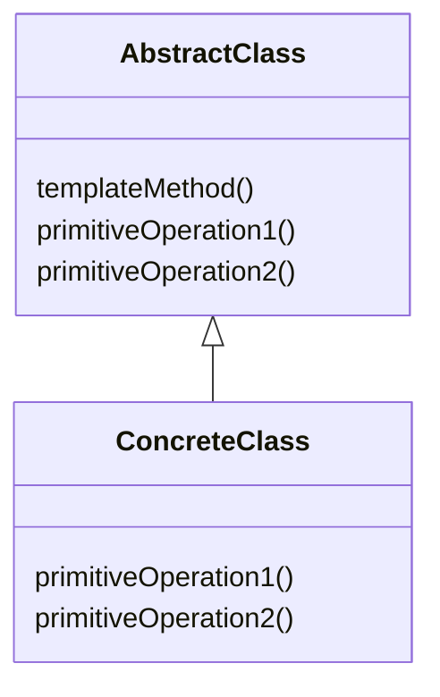
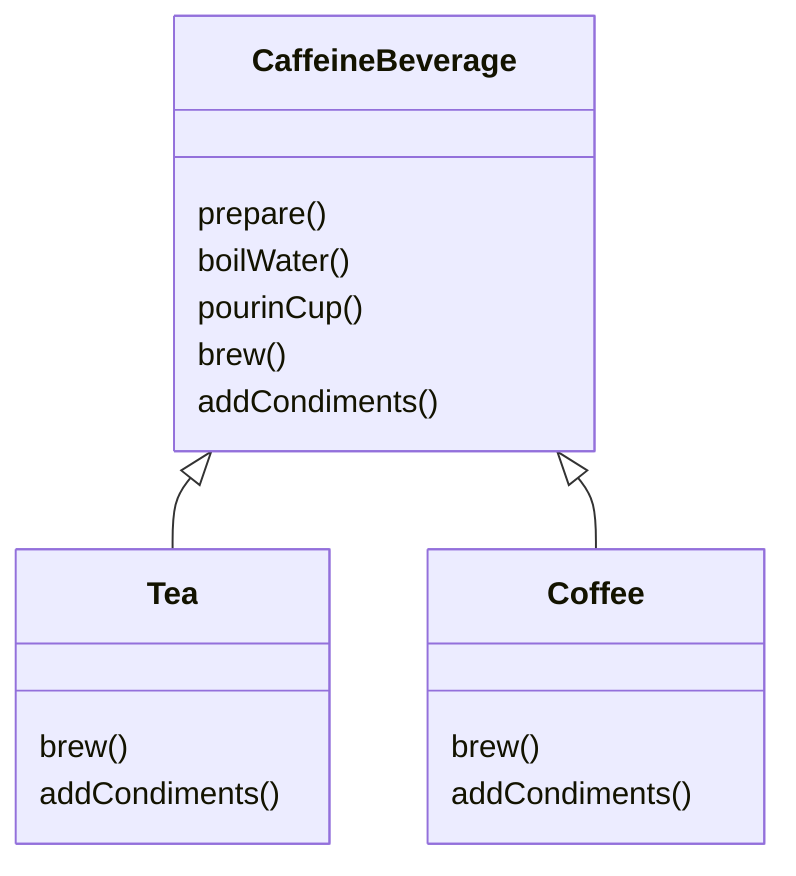

> 设计模式
> 
> [练习实例仓库](https://github.com/EMOSAMA/DesignPatternTry)
> 
> [EMO's Blog](https://emosama.github.io/)


# 模板方法模式
> 封装算法块，以便子类在任何时候都可以挂接进运算里。

> 新的OO设计原则：好莱坞原则，别调用我们，我们会调用你。

## 一个例子引出模板方法模式
### 例子
当存在两个子类都具有相同的方法，但是其中的某些方法需要不同的实现的时候，我们就可以用**抽象类**来构建他们的父类。假如现在有咖啡和茶这两种子类，他们都具备煮沸水，冲泡，倒进杯子，加调料这四种方法，其中冲泡和加调料需要不同的实现，我们可以用下面这种方式来为他们构建父类
```java
public abstract class CaffeineBeverage {
    
    void boilWater() {
        ......
    }
    void pureinCup() {
        ......
    }

    abstract void brew();

    abstract void addCondiments();
}
```
而后子类只需要针对brew和addCondiments去进行实现就行了。
```java
public class Tea extends CaffeineBeverage {
    @override
    public void brew() {
        ......
    }

    @override
    public void addCondiments() {
        ......
    }
}
```
然后我们思考这样做的目的是什么，我们构建一个共同方法的基类，继承后，子类再去扩展自己的特色方法不是效果一样的吗
```java
public class CaffineBeverage {
    void boilWater() {
        ......
    }
    void pureinCup() {
        ......
    } 
}

public class Tea extends CaffeineBeverage {
    public void brew() {
        ......
    }

    public void addCondiments() {
        ......
    }
}
```
上面这种实现方式除了没有达到订单和饮料的具体实现之间的完全解耦以外，还有另外一个弊端。假如我们现在需要给饮料构建他们的准备流程方法*prepare*，里面需要按流程顺序用到饮料自身的四个基础方法。
```java
public abstract class CaffeineBeverage {
    public final void prepare() {
        boilWater();
        brew();
        pourinCup();
        addCondiments();
    }

    public void boilWater() {
        ......
    }
    public void pourinCup() {
        ......
    }

    public abstract void brew();
    public abstract void addCondiments();
}
```
通过抽象的方法实现了*prepare*流程方法和具体饮料之间的解耦。外部在调用*prepare*准备饮料时，不需要知道具体准备的是哪一款饮料，*prepare*当中涉及的调用包含父类提供的公共方法也包含子类自己进行实现的方法。而且我们可以看到我们将*prepare*方法设定为了*final*，意味着他将不能修改，也就是每个子类虽然在流程的每个环节上可以有自己的实现，但是必须遵循这样一个统一的流程规划。其实这就是**模板方法模式**，它定义了一个算法的步骤流程，并允许子类在每个步骤上有自己特定的实现。也可以说是我们将步骤流程封装好了。
### 模板模式与常规方法的比较
- 常规方法中子类自己控制流程，而模板方法中由父类控制，可以很好的保护这个算法。也更好追踪流程。
- 子类中存在的公用方法在父类中统一实现。
- 方便维护，在针对流程算法修改的时候，我们只需要在父类这一个地方进行修改。
- 职责分明，父类专注于算法本身，而子类专注于实现。

## 定义模板方法模式
> **模板方法模式**在一个方法中定义一个算法的骨架，而将一些步骤延迟到子类当中。模板方法使得子类可以在不改变算法结构的情况下，重新定义算法当中的某些步骤。

从上面的例子当中，我们可以看到*prepare*就是模板方法，它在父类当中定义了算法的流程，但却将一部分流程的具体实现下放到了子类当中。


## 更近一步规范的模板方法
### 钩子
我们在构建模板方法的抽象类的时候可以将子类的通用方法在抽象类中实现并设定为*final*，表示其不能被子类修改的特性。但是我们可以有一些钩子方法不需要定义为*final*，其在子类中可以被覆盖，主要用来控制模板方法中的流程。看下面这个例子，依旧还是*CaffeineBenverage*这个例子，但是我们这次*prepare*这个流程当中的addCondiments这个流程我们需要能够让子类控制其是否执行。
```java
public abstract class CaffeineBeverage {
    final void prepare() {
        boilwater();
        brew();
        pureinCup();
        if (customerWantsCondiments()) {
            addConddiments();
        }
    }

    final void boilWater() {
        ......
    }
    final void pureinCup() {
        ......
    }

    abstract void brew();
    abstract void addCondiments();

    boolean customerWantsCondiments() {
        return true;
    }
}
```
上面代码中，我们可以看到，*prepare*当中的*addCondiments*流程的执行与否是由*customerWantsCondiments*方法来控制的，而子类可以通过覆盖该方法来控制*prepare*流程。
```java
public class Tea extends CaffeineBeverage {
    @override
    void brew() {
        ......
    }

    @override
    void addCondiments() {
        ......
    }

    boolean customerWantsCondiments() {
        String answer = userInput();
        if (answer == "yes") {
            return true;
        } else {
            return false;
        }
    }

    String userInput() {
        ......
    }
}
```
上面的代码中，我们可以看到*Tea*子类可以通过*userInput*方式来影响*customerWantsCondiments*方法，并最终影响到父类的*prepare*模板方法。通过钩子(Hook)函数，我们可以赋予模板方法更多的灵活性。
### 好莱坞原则
> **好莱坞原则**：别调用我们，我们会调用你

也就是高层组件能调用低层组件的函数，而低层组件无法调用高层组件。调用的关系需要时单向的。在模板方法中我们可以很清晰的看到这个原则。抽象父类中定义的模板方法单向调用了子类中的操作。依旧以上面的**CaffeineBeverage**为例子

可以看到Caffeine在需要子类实现算法的时候，会调用子类。而子类只是简单的提供实现。同时客户代码也只依赖于抽象的CaffeineBeverage，淡化了依赖关系，实现了与具体实现Coffee以及Tea之间的解耦。
## 一些模板方法的现实例子
### 利用模板方法排序
在排序中，有两个比较通用的需求功能，一个是比较(Compare)，一个是交换(Swap)。Swap可以看作是一个可以final的通用方法，而compare则是需要具体实现的抽象方法，因为不同的Object都会涉及到不同的比较方式。这里，Sort方法就可以看作是一个模板方法，它调用了通用的Swap方法以及抽象的Compare方法，子类会根据需求去实现具体的Compare方法。在Java中有Comparable抽象类，继承于这个类的子类，就需要实现compareTo方法。
