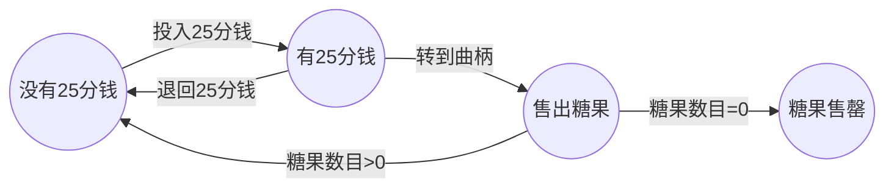
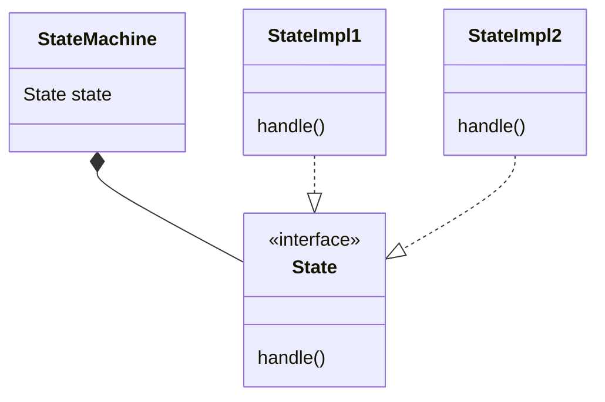

> 设计模式
> 
> [练习实例仓库](https://github.com/EMOSAMA/DesignPatternTry)
> 
> [EMO's Blog](https://emosama.github.io/)
> 

# 状态模式
> **状态模式**允许对象在内部状态改变时改变它自己的行为，对象看起来好像修改了它的类。

> **问题**：在这个实际里面*StateMachine类*会调用*State类*的行为函数，而*State*类的行为函数中又会反过来调用*StateMachine*类中的函数来切换状态。这不是违背了**好莱坞设计原则**吗？

> **个人感觉**：这里好像的确有这样的问题，这也导致了和**策略模式**相比，我们在进行扩展行为的时候无法只是单纯的构建一个新的State的子类，还需要针对StateMachin以及其他的State子类内部进行修改，这一定程度上也违背了**对修改关闭原则**。这是因为我们的状态的切换需求，导致了我们类与类之间的依赖变多了，StateImpl依赖StateMachine，StateMachine依赖StateImpl，StateImpl1依赖StateImpl2.

## 为什么需要状态模式
### 例子
在某些场景下，我们会需要设计一个类具备不同状态的，而在不同状态下需要它执行不同的行为。比如下面的糖果机例子：



根据上面的图，我们可以获得以下信息：
- 4个状态<br>
    - 糖果售罄
    - 没有25分钱
    - 有25分钱
    - 售出糖果 
- 4个行为<br>
    - 投入25分钱
    - 退回25分钱
    - 转动曲柄
    - 售出糖果

### 不用状态模式
如果要为上面的例子设计架构，按照常规的思路我们可能会：
1. 定义全局变量储存当前状态标记。
2. 根据当前状态使用if语句来判断需要执行的代码块。
```java
public class GumballMachine {
    // 定义四个状态
    final static int SOLD_OUT = 0;
    final static int NO_QUARTER = 1;
    final static int HAS_QUARTER = 2;
    final static int SOLD = 3;

    // 标识当前状态
    int state = SOLD_OUT;

    // 投入硬币这个行为的函数
    public void insertQuarter() {
        if (state == SOLD_OUT) {
            ......
        } else if (state == NO_QUARTER) {
            // 当前状态切换
            state = HAS_QUARTER;
        } else if (state == HAS_QUARTER) {
            ......
        } else if (state == SOLD) {
            ......
        }
    }
    // 剩下的三个行为实现类似
    ......
}
```
上面这种设计模式，明显缺点很多：
- 阅读性很差
- 太多if，难以维护
- 很难应对需求变换，不满足对修改关闭，对扩展开放的原则 

### 如果使用状态模式
状态模式其实和策略模式很想，首先我们也可以看到需要**变化**的部分**不同状态下操作有不同的行为**。我们就可以将状态机中的状态分离出来设计成接口类。这样我们想要扩展新的状态也会很简单。而后状态也会以一种组合的方式加入到状态机当中去。

状态模式和策略模式的区别主要就在于意图不同，状态模式是为了针对这种状态需要在运行时不停变化的场景。

使用状态模式后，我们可以这样来设计状态机：



以上面的例子为例
```java
// 构建State接口
public interface State {
    public void insertQuarter();
    public void ejectQuarter();
    public void turnCrank();
    public void dispense();
}

// 起中一种State的实现
public class NoQuarterState implements State {
    GumballMachine gumballMachine;

    public NoQuarterState(GumballMachine gumballMachine) {
        this.gumballMachine = gumballMachine;
    }

    @override
    public void insertQuarter() {
        gumballMachine.setState(gumballMachine.getHasQuarterState());
    }

    @override
    public void ejectQuarter() {
        ......
    }

    @override
    public void turnCrank() {
        ......
    }
    
    @override
    public void dispense() {
        ......
    }

}

// StateMachine，也就是糖果机的实现
public class GumballMachine {
    final static State noQuarterState;
    final static State hasQuarterState;
    final static State soldOutState;
    final static State soldState;

    public GumballMachine() {
        noQuarterState = new NoQuarterState(this);
        hasQuarterState = new HasQuarterState(this);
        soldOutState = new SoldOutState(this);
        soldState = new SoldState(this);
    }

    // 行为方法
    public void insertQuarter() {
        state.insertQuarter();
    }
    ...... // 其他几个方法也一样

    // Get和Set方法
    ......
}
```
这里我们可以看到不再有大量的if语句出现了，对于代码的扩展性也有了很大的提高，虽然状态切换导致的类与类之间依赖度过高，会导致我们在扩展的时候可能也需要对已完成的代码块进行修改。
