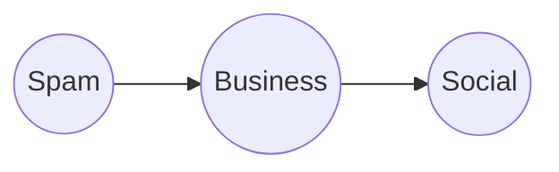
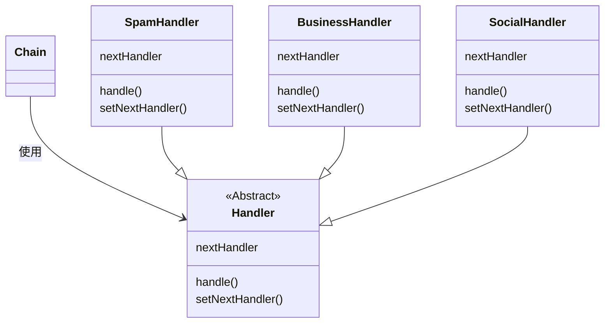

> 设计模式
> 
> [练习实例仓库](https://github.com/EMOSAMA/DesignPatternTry)
> 
> [EMO's Blog](https://emosama.github.io/)
> 

> 责任链模式让一个以上的对象有机会能够处理某个请求。
## 责任链模式结构
责任链模式是为了让*请求的发送者*和*请求的接收者*之间解耦。这么做能够方便扩展。

假设我们现在需要开发一个邮件过滤系统，邮件的种类有三种：垃圾邮件，商业邮件，社交邮件。我们需要将其过滤后分别发送给不同的对象。这个时候我们就可以使用责任链模式来过滤邮件请求并进行转发。大致的流程如下：



Spam处理器识别邮件不是Spam的话，就会将邮件传递给下一个处理器Business，而后流程以此类推。

我们可以看到这样的结构本质上和if语句的功能比较类似，但是很容易扩展，而且允许动态的扩展。如果我们需要删除一种种类，我们只需要将链上对应的处理器删掉即可。如果我们现在新增了一种邮件，我们这只需要创建一个新的处理器对象并加入到链中即可。

每个处理器都必须继承于同于同一个父类，他的大致结构如下



根据上诉结构我们可以设计以下代码架构
```java
public abstract class Handler {
    Handler nextHandler;
    public Handler() {
        this.nextHandler = null;
    }
    public void setNextHandler(Handler nextHandler) {
        this.nextHandler = nextHandler; 
    }
    public abstract void handle();
}

public class SpamHandler extends Handler {
    @override
    public void handle() {
        // 删除垃圾邮件
        ......
    }
}

public class BusinessHandler extends Handler {
    @override
    public void handle() {
        // 转发商业邮件给商业部
        ......
    }
}

public class SocialHandler extends Handler {
    @override
    public void handle() {
        // 转发社交邮件给个人
        ......
    }
}

public class Chain {
    public static void main(String[] args) {
        spamHandler = new SpamHandler();
        businessHandler = new BusinessHandler();
        socialHandler = new SocialHandler();
        startNode = spamHandler;
        spamHandler.setNextHandler(businessHandler);
        businessHandler.setNextHandler(socialHandler);
    }
}
```
