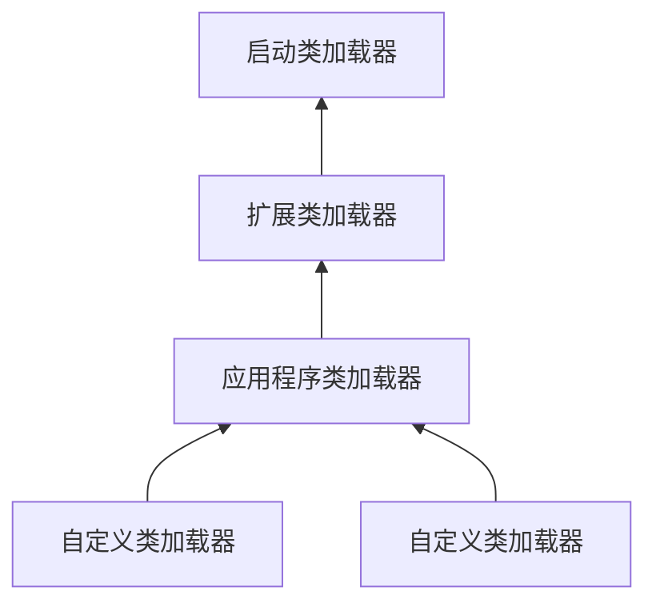

> JVM
> 
> [EMO's Blog](https://emosama.github.io/)
> 

## 类加载的流程
类型的生命周期：

JVM把class文件加载到内存，并对数据进行校验，解析并初始化，最终形成JVM可以直接使用的Java类型的过程。

### 加载
获取类型的二进制字节流，然后将这些静态数据转存成方法区中的运行时数据结构，在内存中生成一个代表这个类的java.lang.Class对象，作为方法区数据的访问入口。加载中对于二进制字节流的来源没有做任何限制，这带来了很大的灵活性，我们可以通过网络，数据库，压缩包，自动生成等各种方式获取二进制字节流。

### 链接Linking

#### 验证
确保加载的类的信息符合JVM规范，没有安全方面的问题

#### 准备
正式为类变量(static变量)分配内存并设置初始值的阶段。这些内存都在方法区中进行分配。要注意类变量不是指实例变量，实例变量是在对象实例化的时候，随着对象一起分配在java堆中。
```java
public class Test {
    public static int value = 123;
}
```
在准备阶段，*value*的值是0。也就是说初始化阶段，为类变量分配好内存后赋予的初始值就是该变量类型的零值。只有在后面的初始化阶段，*value*才会更新成*123*。

但是也有特殊情况，使用*ConstantValue属性*修饰的类变量会在准备阶段就直接赋值。
```java
public class Test {
    public static final int value = 123;
}
```
上面代码中，类变量被*final*修饰后，*value*的值在准备阶段就是*123*了。

最后我们明确一下类变量，类成员变量以及局部变量的区别，特别是前两者。
- **类变量** 由*static*关键字修饰的静态变量，在准备阶段便会进行内存分配和初始化。
- **实例变量/对象变量/类成员变量** 未被static修饰的声明于方法块之外的变量。在实例化对象的时候才会分配内存以及初始化。
- **局部变量** 声明于方法块之内的变量或者函数的参数。

#### 解析
虚拟机常量池内的**符号引用**替换为**直接引用**的过程。
- 符号引用与虚拟机内存布局无关，但是所有的的虚拟机都需要遵守相同的符号引用规范，这是明确定义在<<java虚拟机规范>>的Class文件格式中的。
- 直接引用是能够**直接指向目标**(比如指针，相对偏移量等)或者**间接定位到目标**的句柄，直接引用指向的目标都一定是已在内存中存在的。

### 初始化 
执行类构造器\<clinit\>()方法的过程。类构造器\<clinit\>()方法是由编译器自动收集类中的所有类变量赋值动作和静态语句块(static块)中的语句合并产生的。该方法的执行是被正确加锁和同步的，是线程安全的。

当初始化一个类的时候，如果其**父类还没有被初始化**，那么需要**先初始化父类**，也就是先执行父类的\<clinit\>()方法。

值得注意的是\<clinit\>()方法会优先执行类变量赋值，然后再执行static块中的语句。而且因为类的声明是在**准备**阶段就已经做好了，所以代码顺序中，代码块中**对类变量的赋值是可以写在类变量声明之前**。但是**对变量的访问必须是在变量声明之后**。
如下例子：
```java
public class Person {
    public static String name = "张三";

    static {
        // 赋值写在在声明之前
        age = 20;
        
        // 此操作不允许
        System.out.printlm(age);
        
        System.out.println("初始化age");
    }

    public static String address;
    
    static {
        address = "北京";
        System.out.println(address);
        age = 34;
    }

    public static int age;
}
```

\<clinit\>()中的顺序是
```java
// 先加载类变量
public static String name;
public static String address;
public static int age;

// 后static块中语句执行
static {
    // 初始化中的赋值顺序按照出现顺序来

    name = "张三";
    age = 20;
    // System.out.println(age) 非法前向引用
    System.out.println("初始化age和name");
    address = "北京";
    System.out.println(address);
    age = 34;
}
```
这个例子中出现了**非法前向引用**错误。

```java
System.out.println(age)
```

但是在实际的类加载流程中，我们可以看到实际执行到这个语句的时候，*age*其实已经在内存中存在了，所以在正常的逻辑里*age*应该是可以访问的。所以**非法前向引用**不是一个内存上的访问错误，而是一个规则上的限制。这么做的目的是规避下面这种行为：

> 如果字段会进行初始化，一定要防止在初始化前程序中访问默认值。

```java
public class Test {
    static {
        System.out.Println(value);
        value = 10;
    }
    public static int value;
}
```
在构造器多态中，这种行为会带来很多问题。具体参考:
(https://blog.csdn.net/hsz2568952354/article/details/97496917)  

## 类加载器
> 类加载器是在JVM外部的实现**加载**行为的代码

### 类与类加载器
一个类在JVM当中的唯一性是由类加载器和类本身共同决定的。也就是说两个一摸一样的类，通过两个不同的类加载器加载后，是不相等的。

### 双亲委托模型
类加载器分两种：
- 基于c++实现的**启动类加载器**(Bootstrap ClassLoader)。这是jvm的一部分。
- 基于java实现的继承于抽象类*java.lang.ClassLoader*的其他所有加载器。

Java中使用的是**三层类加载器模型**以及**双亲委派模型**。



使用这些模式和策略的目的是为了防止重复加载。
- **启动类加载器** 用于加载\<JAVA_HONE\>\lib下的类。
- **扩展类加载器** 用于加载\<JAVA_HONE\>\lib\ext下的类
- **应用程序类加载器** 用于加载用户路径上的所有类
- **自定义类加载器** 用户自定义的类加载器

他们每层之间的关系模型叫双亲委派模型。除了启动类加载器以外，每个加载器都有自己的父类加载器。但是它们之间的关系是通过**组合**而不是**继承**来实现的。每当类加载器收到一个加载请求后，都会将这个请求发给父加载器去执行，只有当父加载器无法执行时，才会考虑是否能自己执行。这种带有优先级的层级关系，避免了类重复的发生。

