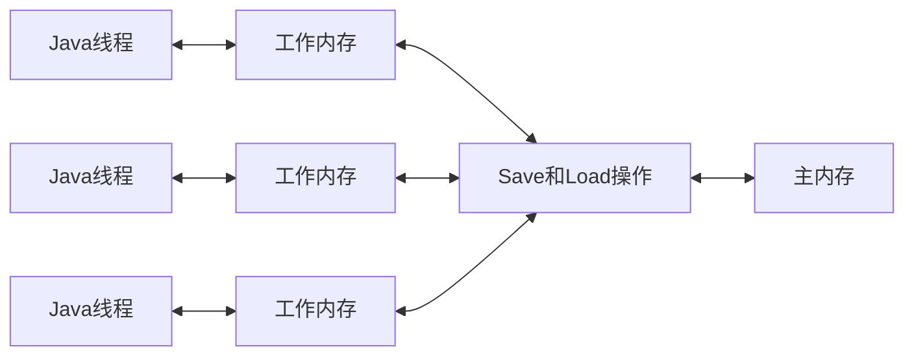

> JVM
> 
> [EMO's Blog](https://emosama.github.io/)
> 

## Java内存模型概念
目的：定义程序中各种**变量**的访问规则，即变量值的存与取的规范。  
其中变量指：
- 实例字段
- 静态字段
- 构成素组对象的元素  

不包括线程共享的那些变量。因为他们不存在竞争问题。

内存模型规定了：
- 如何和何时看到其他线程修改后的变量
- 必须时如何同步的访问共享变量

## 内存模型结构
内存模型将内存划分成了**主内存**和**工作内存**。线程与这两种内存之间的交互流程如下



内存模型定义的是一种抽象的架构，没有直接绑定对应的物理硬件。但其基本逻辑与物理的内存访问是一致的。其中**主内存**指访问比较慢的共享内存块，而**工作内存**指线程独享的但是访问速度快的内存块。我们也可以直接将
- 主内存对应于*memory*
- 工作内存对应于*register*或者*cache*

## 内存模型常规的交互操作
在JVM中我们知道对象是存在堆中的，而堆是线程共享的，那么可以把堆看作是存储在主内存上的。而栈则是线程独享的，我们可以把它看作是在工作内存中的。当一个线程想要访问一个对象的时候，他是通过栈中对象的引用区锁定堆中的对象的，而当他想要对对象中的成员变量做操作时，他其实是无法直接操作的，需要将成员变量拷贝到工作内存中。


那么涉及到多线程读写的时候，这种模式就需要考虑**线程安全/并发安全**问题了，怎么避免操作冲突就是内存模型需要设计的。内存模型规范了线程，工作内存，主内存之间的操作类型以及操作规则。

操作类型：
- lock
- unlock
- read
- load
- use
- assign
- store
- write


操作规则：
1. read和Load，store和write操作不能单独出现
2. assign操作不能丢弃
3. 没有assign不能write
4. 新变量只能从主存中诞生
5. 同一时间只能一个线程lock
6. 执行lock时，需要清除工作内存中的值，重新通过Load或者assign去初始化
7. 没有lock则不能unlock
8. unlock之前，必须要先进行store+write

## Volatile型变量
### Volatile介绍
- 最轻量级的同步机制
- 特性一：对所有线程可见，因为每次使用都需要刷新
- 依旧有线程安全问题，因为java的运算操作不是原子操作。
- 使用Volatile需要满足以下条件：
    - 运算结果不依赖于变量当前值，或者确保只有单一的线程会修改变量的值。
    - 变量不需要与其他状态变量共同参与不变约束。
- 禁止重排序优化，添加内存屏障
### Volatile的特殊交互规则
1. 因为每次使用时都需要刷新，所以*use*需要和*read & load*绑定出现。
2. 因为每次变量的更新都需要立马写到主存中，所以*assign*和*store & write*绑定出现。
3. 先use的一定先read，先assign的一定先write。保证不会重排序。

```  
Var:   
    V and W  
Opt:  
    A1: use or assign for V  
    A2: use or assign for W  
      
    B1: load or store for V  
    B2: load or store for W  
     
    C1: read or write for V  
    C2: read or write for W  
     
    if A1 before A2, then C1 before C2
```
## 针对Long和double类型的规则
Java对于八种操作都要求具备原子性。但是对于64bit的未被volatile修饰的long和double类型，允许其load，store，read，write操作分两次32bit操作来执行。这就是所谓的**long和double的非原子性协定**。所以理论上时会出现读取到半个变量的情况。但是这种情况比较罕见，所以没特殊原因没必要定义为volatile。

## 原子性，可见性与有序性
### 原子性
read，load，use，assign，store，write等六个操作都具备原子性，除了long和double的特殊情况以外。而lock和unlock操作虽然没有直接开放操作权限给用户，但是也提供了通过synchronized来隐式的使用。
### 可见性
可见性是指一个变量被修改新值后能立刻被其他线程得知。Java内存模式保证在变量修改后同步到主存，读取时也刷新变量值来保证可见性的。而volatile关键字则是多了一个“立即”，从而能保证多线程操作时的可见性。除此之外，final和synchronized关键词也可以保证可见性。

### 有序性
Java程序中的有序性是指在单线程内所有的操作都是有序的，而如果从一个线程中去看另一个线程，操作则是无序的，这是因为重排序和工作内存和主存之间的同步延迟导致的。

## 先行发生(Happen-Before)原则
> 判断数据是否发生竞争，线程是否安全的手段。

如果操作A **Happen-Before** B，那么意味着操作A带来的变化一定能够被观察到。
```java
// 线程A中
i = 1;

// 线程B中
j = i;

// 线程C中
i = 2; 
```

如果 i = 1 happen before j = i，那么我们能够保证j能够读取到正确的值，但是如果 i = 2 和 j = i 之间没有 happen-before 关系，那么意味着j将无法确定获取到1还是2，线程这时就不安全了。

Java中存在一些“天然的” happen-before 关系，不需要同步器协助：
- **程序次序规则** 在一个线程内，按照控制流顺序执行
- **管程锁定规则** 同一个锁上unlcok操作一定先发于它后面的lock操作
- **volatile变量规则** write --> read能保证和时间顺序一致 
- **线程启动规则** start先行于线程内的所有操作
- **线程终止规则** 终止发生于所有操作之后
- **线程中断规则** 对线程interrupt的调用 ---> 感知到interrupt事件
- **对象终结规则** 构造函数 ---> finalize()
- **传递性** A ---> B，B ---> C，则A ---> C
