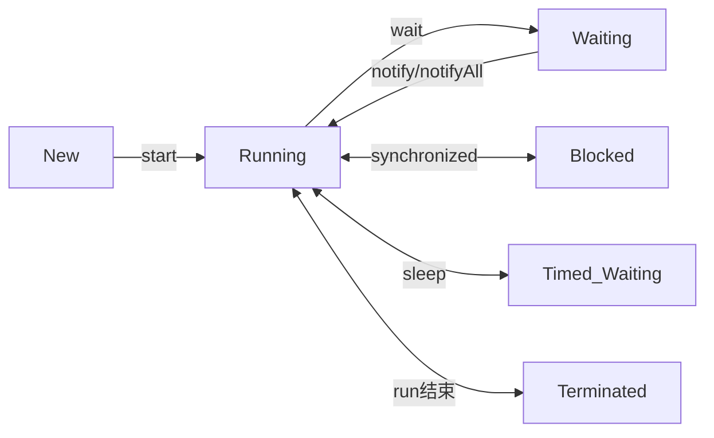

## 线程的实现
Java中的java.lang.Thread类，用的都是*Native*方法。

三种实现方式：
1. 使用内核线程实现(1:1) 一个进程一个线程
2. 使用用户线程实现(1:N) 一个进程N个线程
3. 用户线程加轻量级进程混合实现(N:M) N个进程M个线程

### 内核线程实现
轻量级进程LWP，每一个都由一个内核线程支持，所以能独立调度。但这也有意味着他的线程操作都是发生在内核空间的，即需要涉及到代价高的系统调用。

[图片P456]

与内核线程1:1绑定带来的缺点：
1. 上下文切换，开销大
2. 占用内核资源，能创建的数量有限

### 用户线程实现
> 思考：用户线程和协程的关系。

直接建立在用户空间的进程上的1:N关系。不与内核态线程绑定，内核空间原则上无法观察到用户线程。

[图片P456]

这种和内核解绑的模式，既是优点也是缺点。
优点：
- 很少涉及系统调用，开销小。
- 能支持更大规模的并发。
缺点：
- 实现复杂，线程的调度，处理器映射，阻塞处理之类都需要在用户空间中去实现。

### 混合实现
用户线程建立在轻量级进程之上，而轻量级进程和内核线程依旧是绑定关系，这样既可以让轻量级进程作为桥梁帮助解决调度，阻塞，映射等事务。用户线程和轻量级进程之间的数量比是不定的，所以也叫N:M关系。

[图片P457]

### Java线程实现
Java线程的实现和规范无关，有JVM决定，不同的JVM有不同的线程实现方式。

## Java线程调度
### 协同式(Cooperative Thread-Scheduling)线程调度
线程的执行时间和切换由线程本身控制，一个线程执行完了通知其他线程切换。

优点：
- 一般不会有线程同步的问题
- 实现简单

缺点：
- 时间不可控
- 如果线程自身出了问题，容易发生阻塞

### 抢占式(Preemptive Thread-Scheduling)线程调度
每个线程的执行时间由系统来分配，系统可控的，不会因为一个线程的执行问题导致整个系统阻塞崩溃。Java中使用的抢占式线程调度通过设立10种线程优先级的方式，能够一定程度上控制特定线程的执行时间。但是java中线程的调度本质上还是映射到内核中去进行的。所以一定程度上还是取决于系统本身，比如windows系统只有7种优先级，那么Java中的多个优先级就不得不映射到同一个系统优先级中去，从而表现出相同的优先级状态。

## 状态转换
Java中给线程定义了6种状态
- **新建 New** 刚创建好还没有启动
- **运行 Runnable** 包括系统线程状态中的Run和Ready
- **无限期等待 Waiting** 需要被其他线程显式的唤醒
- **限期等待 Timed Waiting** 只需等待一段时间自动唤醒
- **阻塞 Blocked** 线程等待一个排它锁
- **结束 Terminated** 终止线程

