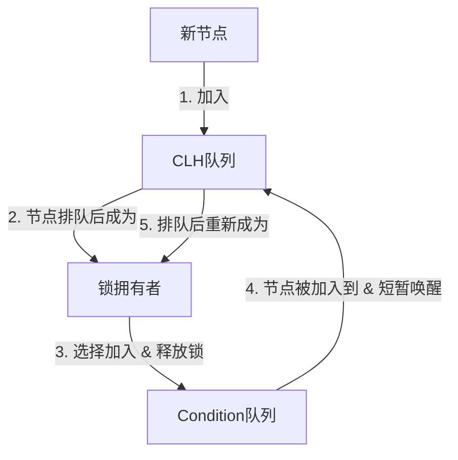
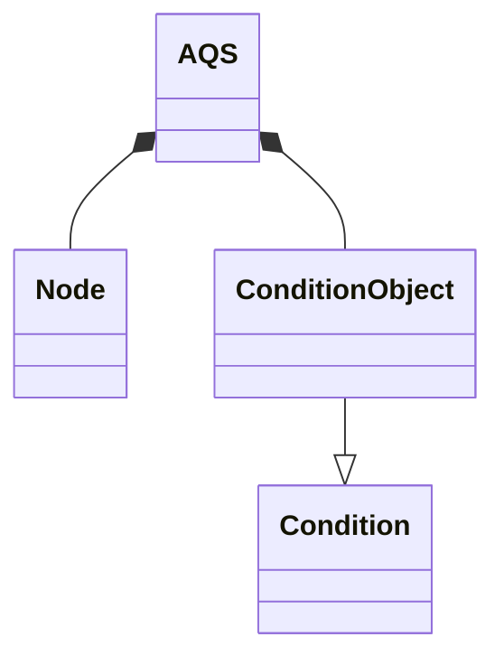
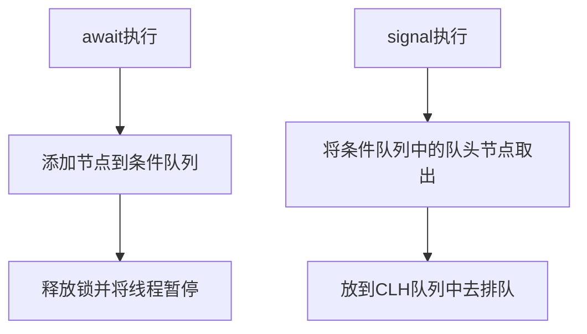

> AQS
> 
> [EMO's Blog](https://emosama.github.io/)


# 概览
AQS总体是基于两种队列来设计的
1. CLH队列，这是一种虚拟队列，没有一个队列实体，只由节点自己来维护队列关系。主要承担的功能是t
    - acquire锁
    - release锁
2. Condition队列，这是一个单向链表，主要是用来实现和Sychronized里的wait，notify以及notifyAll相似的功能的，在这里面分别是
    - await 有五种await，但是实现核心是差不多的。主要是两个类型
        - 两个不带参数的await，需要signal唤醒，其中一个可以由InterruptedException唤醒
        - 三个带参数的await，定时自动唤醒
    - signal
        - signal 只把Condition队头的节点放到CLH中去竞争锁
        - signalAll 将Condition队列里的全部节点都放到CLH中去竞争锁

本质上Condition队列就是一个CLH队列的预备队列，里面的节点准备着在某个确定的或者不确定的时间节点加入到CLH当中去。

一个经历了两个队列的节点，他的职业生涯如下：


上面两种队列当中的成员都是由一个Node类来定义的。Node类当中的指针有三种
下面两个是为了提供给双向链表构建的CLH队列去使用的
- prev
- next

下面这一个是提供给单向链表Condition队列去使用的
- nextWaiter

# 锁的控制机制
AQS当中锁的占用是通过对两个变量的修改来达成的
- state
- exclusiveOwnerThread

当一个线程想要占用一个锁的时候需要修改state的值，并将exclusiveOwnerThread设置为自己。同样的，当 *state > 0* 或者 *exclusiveOwnerThread != null* 时，说明这个锁被占用了。

*exclusiveOwnerThread* 是通过继承 *AbstractOwnableSynchronizer* 来得到的。

实际的锁的获取与释放其实都在通过 *CAS(Compare and Set)* 的方式来控制这两个变量而已，QAS其他大量的设计其实都是在解决如何安排线程尝试抢锁以及如何通过park和unpark来避免抢不到锁的线程一直自旋。

# Node类
```java
static final class Node {
    static final Node SHARED = new Node();
    static final Node EXCLUSIVE = null;
    static final int CANCELLED =  1;
    static final int SIGNAL    = -1;
    static final int CONDITION = -2;
    static final int PROPAGATE = -3;
    volatile int waitStatus;
    // prev和next构建的双向链表
    volatile Node prev;
    volatile Node next;
    // 持有的thread。如果是head节点，这里为null
    volatile Thread thread;
    Node nextWaiter;

    final boolean isShared() {
        return nextWaiter == SHARED;
    }

    // 返回prev节点，如果prev = null，抛出NullPointerException
    final Node predecessor() throws NullPointerException {
        Node p = prev;
        if (p == null)
            throw new NullPointerException();
        else
            return p;
    }

    Node() {    // Used to establish initial head or SHARED marker
    }

    Node(Thread thread, Node mode) {     // Used by addWaiter
        this.nextWaiter = mode; // 设定模式
        this.thread = thread;
    }

    Node(Thread thread, int waitStatus) { // Used by Condition
        this.waitStatus = waitStatus;
        this.thread = thread;
    }
}
```

## 资源共享方式
其定义了两种资源获取方式：
- **独占 Node.EXCLUSIVE** 只有一个线程能访问执行。如：ReentrantLock
    - **公平锁** 按队列顺序进行
    - **非公平锁** 对资源进行竞争，谁抢到就是谁的

    在 *AQS* 相关锁，如 *ReentrantLock* 中，**公平锁**和**非公平锁**的区别就在于，公平锁在尝试获取锁的时候，多了一个判断条件 *!hasQueuedPredecessors()*。其功能如命名，队列中在此线程之前是否存在其他排队的线程，其实就是判断是否需要排队
- **共享 Node.SHARED** 多个线程可同时访问执行。如：*CountDownLatch*，*Semaphore*

## Node中的waitStatus
- *CANCELLED (1)* 表示当前线程被取消
- *SIGNAL (-1)* 表示当前节点的后继节点park了，需要unpark唤醒
- *CONDITION (-2)* 表示当前节点在等待condition，也就是在condition queue中
- *PROPAGATE (-3)* 表示当前场景下后续的acquireShared能够得以执行
- *0* 初始化状态

# CLH队列
## 简介
*AQS* 中使用了CLH队列为等待锁的线程排队，而CLH是一种虚拟双向队列，即不存在队列实列，只有节点与节点之间的关联关系，这里的节点就是上面的Node类。因此CLH队列的原理就是将请求共享资源的线程打包成CLH锁队列的一个节点来实现锁的分配。head节点是一个虚拟节点，他不持有信息，只是单纯的指向排在第一位的节点。
> Head --> First --> Second/Tail

上面就是一个CLH队列。队列的移动是按照两个规则来的
1. 排队的 *First* 线程获取到了资源，发放锁后，将 *Head* 指针移动到 *First* 节点，并将First节点里面的信息清空。
    > Head --> Second/Tail

2. 新加入一个节点时，将 *Tail* 移动到新节点这儿来，成功后直接接在 *Tail* 之前所在的节点后面
    > Head --> First --> Second --> Third/Tail

加入新节点一般是在 *addWaiter* 方法里进行的
```java
private Node addWaiter(Node mode) { // 这里的mode是指资源共享方式，有EXCLUSIVE和SHARED
        Node node = new Node(Thread.currentThread(), mode);
        // Try the fast path of enq; backup to full enq on failure
        Node pred = tail;
        if (pred != null) { // 如果pred为空，说明该AQS还没有被初始化
            node.prev = pred;
            if (compareAndSetTail(pred, node)) { // 将Tail移动到新节点成功过后
                pred.next = node; // 接在CLH队尾 
                return node;
            }
        }
        enq(node); // 两种情况会进入到这里
        return node;
    }
```
上面的代码中，正常情况下，新节点就加入到队尾了，但是有两种情况会导致第一次的加入失败
1. 还没有初始化，即上面代码中的第一个if判断失败
2. CAS执行失败，即上面代码中的第二个if判断失败

失败后需要进入到 *enq* 方法中
```java
private Node enq(final Node node) {
        for (;;) {
            Node t = tail;
            if (t == null) { // 还没有初始化
                if (compareAndSetHead(new Node())) // CAS初始化Head的值，不一定会成功
                    tail = head;
            } else {
                node.prev = t;
                if (compareAndSetTail(t, node)) { // CAS更新Tail的值，不一定会成功
                    t.next = node;
                    return t;
                }
            }
        }
    }
```
上面函数中主要对两种情况进行处理，主要流程如下
1. 进入for循环 
2. 先判断AQS是否初始化，如果AQS还没有初始化，先将Head绑定到一个空节点上，然后将Tail指向Head。
3. 执行CAS
4. 循环2，3步骤，直到都成功为止。

## 核心方法流程解析
AQS当中使用了模板方法模式，AQS当中定义了一些功能的执行流程，而其中使用到的具体功能只是接口，需要子类去根据需求自行实现。这些方法总的如下
- 独占方式：
    - tryAcquire(int)
    - tryRelease(int)
- 共享方式
    - tryAcquireShared(int)
    - tryReleaseShared(int)
- 当用到condition的时候需要
    - isHeldExclusively()

### 独占模式
独占模式是通过对state以及exclusiveOwnerThread两个变量操作来确定占有权的。当一个线程获取到锁了后，其他线程就无法获取锁了，只有当这个线程release后，才会唤醒下一个节点去获取锁。
#### acquire方法
```java
public final void acquire(int arg) {
        if (!tryAcquire(arg) &&
            acquireQueued(addWaiter(Node.EXCLUSIVE), arg))
            selfInterrupt();
    }
```
*acquire* 方法中主要调用了三个方法
##### tryAcquire(int arg) 
本质上功能就是试试能不能抢占到。交由子类去实现。

方法中定义了 *acquire* 独占锁的流程，不管是公平锁还是非公平锁，使用 *lock* 方法时，调用的都是相同的 *acquire* 方法，代码如下
```java
public final void acquire(int arg) {
        if (!tryAcquire(arg) &&
            acquireQueued(addWaiter(Node.EXCLUSIVE), arg))
            selfInterrupt();
    }
```
*acquire* 方法定义了一个流程模板，但是其中的 *tryAcquire* 方法，AQS当中只定义了接口，具体的实现是放到了子类当中去根据目的进行不同的设计。比如在 *ReentrantLock* 当中，Sync类继承于AQS，而Sync类又有两个子类 *FairSync* 和 *NonfairSync* 。这两个子类调用的都是 *acquire* 方法，只是他们对于 *tryAcquire* 有不同的设计
- FairSync中
    ```java
    protected final boolean tryAcquire(int acquires) {
            final Thread current = Thread.currentThread();
            int c = getState(); // 获取到state状态
            if (c == 0) { // state为0代表锁空闲
                // 公平锁需要两个条件都需要满足，第一个条件判断自己之前还有没有节点在等待，第二个条件compareAndSetState能够成功
                if (!hasQueuedPredecessors() &&
                    compareAndSetState(0, acquires)) {
                    setExclusiveOwnerThread(current); // 将AQS当中的互斥锁保有线程标记为自己
                    return true;
                }
            }
            else if (current == getExclusiveOwnerThread()) { // 锁不空闲，但是持有该锁的就是线程自己，也可以再次进入，这就是所谓的可重入锁。需要注意释放锁的时候state也需要被释放到 state = 0 时才能被成功释放。
                int nextc = c + acquires; // state的值需要增加
                if (nextc < 0)
                    throw new Error("Maximum lock count exceeded");
                setState(nextc); // 更新state值
                return true;
            }
            return false;
        }
    ```
- NonfairAcquire中
    ```java
    final boolean nonfairTryAcquire(int acquires) {
            final Thread current = Thread.currentThread();
            int c = getState();
            if (c == 0) {
                // 只有这里不一样，非公平锁不需要通过hasQueuedPredecessors方法去做排队判断，只要线程空闲，就直接抢占线程就行，compareAndSetState方法也就是CAS，返回true就代表线程抢占成功。
                if (compareAndSetState(0, acquires)) {
                    setExclusiveOwnerThread(current);
                    return true;
                }
            }
            else if (current == getExclusiveOwnerThread()) {
                int nextc = c + acquires;
                if (nextc < 0) // overflow
                    throw new Error("Maximum lock count exceeded");
                setState(nextc);
                return true;
            }
            return false;
        }
    ```
    
可以看到上面两种设计相差无几，唯一的区别就是FairSync相较于NonfairSync多了一个判断
> !hasQueuedPredecessors()

这个函数是在AQS当中实现的
```java
public final boolean hasQueuedPredecessors() {
        // The correctness of this depends on head being initialized
        // before tail and on head.next being accurate if the current
        // thread is first in queue.
        Node t = tail; // Read fields in reverse initialization order
        Node h = head;
        Node s;
        return h != t &&
            ((s = h.next) == null || s.thread != Thread.currentThread());
    }
```
上面代码的判断逻辑如下
- *h != t* 不成立，代表队列为空，那么返回false，表示在此节点之前没有人排队
- *h != t* 成立，*s = h.next) == null || s.thread != Thread.currentThread()* 不成立，代表队列中排第一的节点就是本节点，返回false，表示在此节点之前没有人排队
- 其他情况返回true，代表前面有人。


##### addWaiter(Node mode)  
tryAcquire失败后，节点入队
```java
// 标识Node时SHARED还是1EXCLUSIVE
private Node addWaiter(Node mode) {
    Node node = new Node(Thread.currentThread(), mode);
    // Try the fast path of enq; backup to full enq on failure
    // 下面这一串enq里都能做，只是这里提供一个快速路径，成功就不用进enq了
    Node pred = tail;
    if (pred != null) { // 如果Tail不为空，直接加在尾部就好
        node.prev = pred;
        if (compareAndSetTail(pred, node)) { // 必须要先保证尾部已经移动成功了，才能进行后续步骤，因为可能发生两个节点同时竞争一个Tail
            pred.next = node; // 满足上面条件后，就可以保证这里只会有本线程会修改了
            return node;
        }
    }
    enq(node); // 两种情况进入这里：1. Tail为null   2. compareAndSetTail竞争Tail失败
    return node;
}
```
在 *enq* 方法中，包含两个功能
1. 判断CLH是否初始化
2. 循环执行compareAndSetTail，直到添加成功为止
```java
private Node enq(final Node node) {
    for (;;) {
        Node t = tail;
        if (t == null) { // Tail为null，需要初始化
            if (compareAndSetHead(new Node())) // 初始化就是给Head添加一个空节点，作为哨兵节点
                tail = head; // 然后把Tail指向Head就行了
        } else {
            // 循环竞争Tail，直到添加成功为止
            node.prev = t; 
            if (compareAndSetTail(t, node)) { 
                t.next = node;
                return t;
            }
        }
    }
}
```

##### acquireQueued(Node node, int arg)
节点入队后，进入轮询获取锁的阶段。
```java
final boolean acquireQueued(final Node node, int arg) {
    boolean failed = true;
    try {
        boolean interrupted = false;
        for (;;) { // 轮询
            final Node p = node.predecessor();
            if (p == head && tryAcquire(arg)) {
                setHead(node);
                p.next = null; // help GC
                failed = false; // 不然会进入到cancelAcquire
                return interrupted; // 未被打断
            }
            if (shouldParkAfterFailedAcquire(p, node) &&
                parkAndCheckInterrupt()) // shouldParkAfterFailedAcquire改变前一个结点的waitStatus；parkAndCheckInterrupt当前线程挂起
                interrupted = true;
        }
    } finally {
        if (failed)
            cancelAcquire(node); // 中断排队后，进入这里，需要将节点从CLH中移除
    }
}
```
在 *acquireQueue* 方法中，for循环不会一直执行，有涉及前一个节点的 *waitStatus* 转变以及当前节点线程挂起的操作。
- *shouldParkAfterFailedAcquire* 对前一个节点的状态进行甄别和处理。其中涉及到的if有三个分支
    - *pred.waitStatus == Node.SINGLE* 返回true表明节点可以进入park
    - *pred.waitStatus > 0* 说明pred节点已经被cancel了，直接跳过pred节点和pred.prev建立联系
    - *else* 说明将pred的waitStatus更新为Node.SINGLE
- *parkAndCheckInterrupt* 进入park状态，调用 *LockSupport.park(this)*
- *cancelAcquire* 当异常抛出的时候，会调用此方法将节点从CLH中Cancel掉

##### cancelAcquire
当抛出异常的时候，就会触发它
- node.predecessor: nullPointerException
- tryAcquire
    - UnsupportedOperationException
    - IllegalMonitorStateException
    - throw new Error("Maximum lock count exceeded") 
- 如果是可中断的，在中断的时候可以抛出InterruptedException，去进行cancelAcquire()

```java
private void cancelAcquire(Node node) {
    // Ignore if node doesn't exist
    if (node == null)
        return;

    node.thread = null; // 先将node中的thread清空

    // Skip cancelled predecessors
    Node pred = node.prev;
    while (pred.waitStatus > 0) // 往上找，找到一个非cancel状态的节点，和他连接起来
        node.prev = pred = pred.prev;

    Node predNext = pred.next;

    // Can use unconditional write instead of CAS here.
    // After this atomic step, other Nodes can skip past us.
    // Before, we are free of interference from other threads.
    node.waitStatus = Node.CANCELLED; // 将自己的waitStatus改成Node.CANCELLED

    // 如果自己是Tail节点的话，只需要将Tail移动到上面一个节点就可以了
    if (node == tail && compareAndSetTail(node, pred)) {
        compareAndSetNext(pred, predNext, null); // 将指向自己的引用设为null
    } else {
        // If successor needs signal, try to set pred's next-link
        // so it will get one. Otherwise wake it up to propagate.
        int ws;
        if (pred != head &&
            ((ws = pred.waitStatus) == Node.SIGNAL ||
            (ws <= 0 && compareAndSetWaitStatus(pred, ws, Node.SIGNAL))) &&
            pred.thread != null) {
            Node next = node.next;
            if (next != null && next.waitStatus <= 0)
                compareAndSetNext(pred, predNext, next); // 将前后节点连接起来
        } else {
            unparkSuccessor(node);
        }
        node.next = node; // help GC
    }
}
```

#### release方法
上面讲了如何排队获取锁的过程，而获取到锁后并使用完后，相应的释放锁的过程就在这里发生
```java
public final boolean release(int arg) {
    if (tryRelease(arg)) { // 看看是否能被释放成功
        Node h = head;
        if (h != null && h.waitStatus != 0)
            unparkSuccessor(h); // 唤醒park中的后继者
        return true;
    }
    return false;
}
```
*unparkSuccessor* 
```java
private void unparkSuccessor(Node node) {
    int ws = node.waitStatus;
    if (ws < 0) // 将status改为0，标识已经释放了
        compareAndSetWaitStatus(node, ws, 0);

    Node s = node.next; // 获取到successor
    if (s == null || s.waitStatus > 0) { // 如果successor为空或者已经被cancel了，需要去寻找最近的未cancel节点
        s = null;
        for (Node t = tail; t != null && t != node; t = t.prev) // 从尾往前遍历
            if (t.waitStatus <= 0) // 如果status不是cancel
                s = t; // 记录下来，for循环结束后s就是离head最近的非cancel节点了
    }
    if (s != null)
        LockSupport.unpark(s.thread); // unpark节点
    }
```
总的来说，release有两个主步骤
1. 释放锁
2. 唤醒successor

在**唤醒successor**这里，为什么要从尾往头找呢？

因为从前往后可能会失败，主要是有两个地方的特殊情况会导致这种情况发生
- addWaiter中，在尾部加入新节点的流程是 
  1. node.prev = (pred = tail)
  2. CompareAndSetTail(pred, node)
  3. pred.next = node
  上面的流程中，如果1，2成功后，3还没有执行就发生了 *unparkSuccessor* ，那么将无法从前往后遍历完所有节点，因为next联系还没有构建
- cancelAcquire中，compareAndSetNext可能会失败，也会导致从前往后的链断掉。
  ```mermaid
  flowchart LR
  Head --> A --> B
  B --> B
  C --> B(Cancel) --> A --> Head
  ```
  如果 *A --> C* 构建失败了，也就是下面代码这里
  ```java
    if (next != null && next.waitStatus <= 0)
        compareAndSetNext(pred, predNext, next);
  ```
  就会发生上图的情况，从前往后的链在被 *Cancel* 的节点这里断掉了。原因是predNext值发生了变化，导致执行失败。那如果修改成下面这样
  ```java
  while (next != null && next.waitStatus <= 0 && !compareAndSetNext(pred, predNext, next)) {
      predNext = pred.next
  }
  ```
  是否就可以保证compareAndSetNext一定能执行成功，从而避免上面 *A --> C* 构建失败的情况发生呢？
  
  不是很清楚上面这种操作是否可行，是否会带来什么弊端。

##### tryRelease方法
与上面相同，tryRelease方法也是release方法当中调用的一个交由子类去实现的接口方法，在 *ReentrantLock* 当中实现如下
```java
protected final boolean tryRelease(int releases) {
    int c = getState() - releases; // 计算新的state值
    if (Thread.currentThread() != getExclusiveOwnerThread()) // 判断当前线程是不是AQS当中记录的锁拥有者线程，这里一般都不会有问题
        throw new IllegalMonitorStateException();
    boolean free = false;
    if (c == 0) { // 因为可重入锁的原因，所以只有当state释放到0的时候才能释放成功
        free = true;
        setExclusiveOwnerThread(null);
    }
    setState(c);
    return free;
}
```

### 共享模式
共享模式和独占模式其实本质上大同小异，只是共享模式可以允许多个线程同时获取同一个锁的特性，有以下几个改变
1. 对锁的获取条件进行了设计
2. 设计了链式唤醒

在锁的获取上，依旧是将实际获取锁的方法 *tryAcquireShared* 交由子类去设计，所以这里实际上变化不大。不过因为多个线程同时拥有锁，所以不再设置 *exclusiveOwnerThread* 了。

更多的变化在于如何进行链式唤醒上，因为允许多个线程同时获取一个锁的原因，每个节点不再只是在有线程 *release* 的时候才被唤醒了。只要锁的共享资源充足，共享模式就不会是只唤醒一个节点就结束了，而是会呈现出一种链式唤醒。会不停的往下唤醒，直到设立的条件不再满足。
- 线程释放锁的时候会进行唤醒流程
- 线程获取到锁的时候也会进行唤醒流程

当然因为多个线程拥有同个锁，就会存在多个线程在相近的时间段里同时释放锁，这个时候会有一些冲突产生。在老版本的AQS当中，这种冲突有时候会造成链式唤醒被打断的情况发生，而后在现在版本中，通过将唤醒条件扩宽泛的形式解决了这种问题，但是这种解决方法也会带来一些**不必要的唤醒(unnecessary wake-ups)**。

#### acquireShared
```java
public final void acquireShared(int arg) {
    if (tryAcquireShared(arg) < 0) // 尝试获取锁，返回小于0，表示没有资源用光了
        doAcquireShared(arg); // 比较类似独占锁的acquireQueue
}

private void doAcquireShared(int arg) {
    final Node node = addWaiter(Node.SHARED); // 添加Shared节点
    boolean failed = true;
    try {
        boolean interrupted = false;
        for (;;) {
            final Node p = node.predecessor();
            if (p == head) { // 需要轮到才有资格
                int r = tryAcquireShared(arg); // 尝试获取，获取成功的话返回的r代表共享锁剩余的资源量。失败的话，为负数。
                if (r >= 0) { // 获取锁成功了，需要对CLH队列操作
                    setHeadAndPropagate(node, r); // 将当前节点设置成head，并要开始进行链式唤醒
                    p.next = null; // help GC
                    if (interrupted)
                        selfInterrupt();
                    failed = false;
                    return;
                }
            }
            if (shouldParkAfterFailedAcquire(p, node) &&
                parkAndCheckInterrupt())
                interrupted = true;
        }
    } finally {
        if (failed)
            cancelAcquire(node);
    }
}
```
上面的流程和独占锁的 *acquire* 方法大差不差，真正的区别在 *setHeadAndPropagate* 中
```java
private void setHeadAndPropagate(Node node, int propagate) {
    Node h = head; // 记录老的head节点，是为了后面对老head的waitStatus进行判断
    setHead(node); // 移动head
    if (propagate > 0 || h == null || h.waitStatus < 0 ||
        (h = head) == null || h.waitStatus < 0) { // 这里的条件比较复杂，主要是为了判断是否需要唤醒自己的successor
        Node s = node.next;
        if (s == null || s.isShared()) // 需要时SHARED节点才行
            doReleaseShared(); // 这里面定义了对successor进行链式唤醒的具体流程
    }
}
```
这里和独占模式的区别是，除了更新了 *Head* 以外，他还定义了链式唤醒的流程。也就是说，唤醒不只是发生在 *release* 的时候了，*acquire* 期间也会发生唤醒。

#### releaseShared
```java
public final boolean releaseShared(int arg) {
    if (tryReleaseShared(arg)) {
        doReleaseShared();
        return true;
    }
    return false;
}
```
了解了上面的代码，这里就比较简单了。当release成功后，会进入到 *doReleaseShared* 当中去进行链式唤醒。

#### doReleaseShared方法
首先思考一个问题，上面为什么需要 *doReleaseShared* 这个方法。如果我们将其直接替换成 *unparkSuccessor(h)* 会怎么样呢？

我们可以看到，如果代码进行这样的切换后，依旧是能够达到链式唤醒的目的的，切换后的代码如下
```java
private void setHeadAndPropagate(Node node, int propagate) {
    // Node h = head;  切换点一
    setHead(node); 
    if (propagate > 0 && node.waitStatus != 0) { // 切换点二
        Node s = node.next;
        if (s == null || s.isShared())
            unparkSuccessor(node); // 切换点三
    }
}
```
上面的代码其实就是老版的AQS代码，上面的代码按照常规的流程， *Head -> A -> B -> C* ，如果资源充足的情况下，当 *A* 成为新的 *Head* 后会马上唤醒 *B*，而 *B* 成为新的 *Head* 后，又会马上唤醒 *C*。

##### doReleaseShared和Node.PROPAGATE的引入历程
上面的代码在 *Semaphore* 当中出现了一个bug，也就是在某个特殊情况下，链式唤醒会被打断。
```java
import java.util.concurrent.Semaphore;

public class TestSemaphore {

   private static Semaphore sem = new Semaphore(0);

   private static class Thread1 extends Thread {
       @Override
       public void run() {
           sem.acquireUninterruptibly();
       }
   }

   private static class Thread2 extends Thread {
       @Override
       public void run() {
           sem.release();
       }
   }

   public static void main(String[] args) throws InterruptedException {
       for (int i = 0; i < 10000000; i++) {
           Thread t1 = new Thread1();
           Thread t2 = new Thread1();
           Thread t3 = new Thread2();
           Thread t4 = new Thread2();
           t1.start();
           t2.start();
           t3.start();
           t4.start();
           t1.join();
           t2.join();
           t3.join();
           t4.join();
           System.out.println(i);
       }
   }
}
```
简单直白的介绍一下上面的情况。上面的例子中，*t1* 和 *t2* 在CLH队列当中排队，然后 *t3* 和 *t4* 线程先后进行释放锁。正常情况下，代码运行完，*t1* 和 *t2* 都能获取到锁，但是偶而会出现 *t2* 没有获取到锁的情况。因为在多线程共享锁当中是很容易发生，两个线程在很短的一个时间内同时释放锁的，也就是说有可能两个线程在同一个 *Head* 节点上发起链式唤醒流程，那么这个时候，后面是不会进入到唤醒流程的。以上面的为例，*t3* 释放锁，然后将 *Head.waitStatus* 从 Node.SIGNAL(-1) 改成了 0，*t4* 也释放锁，并访问当了同一个 *Head*，因为不满足 *Head.waitStatus < 0*，所以 *t2* 不会再继续往下运行了。按理来说，这不会出现什么问题，因为 *t1* 成为新的 *Head* 后，会往下唤醒 *t2*。但是，要知道 *t1* 是被 *t3*，唤醒的，而 在 ***t1* 获取锁** 和 ***t1* 成为Head** 之间是有延迟的。*t1* 在刚获取到锁并了解到剩余资源之后，*t4* 才刚好释放了锁，而这个时候 *t1* 还没有成为 *Head* 呢。于是 *t1* 成为 *Head* 后，因为以为锁已经被占满，便没有唤醒 *t2*。

简单直白点来说就是，*t4* 释放了锁，它以为 *t1* 知道新的资源空出来了，但其实 *t1* 它不知道。于是 *t2* 就被 *t4* 和 *t1* 落下了。

要解决这个问题，新版AQS提出的解决方案就是，*t4* 在释放锁的时候，如果他不往下走了，他需要告知别人一下，他的资源放出来了，你们记得放别人去拿一下。

具体的解决方案在 *doRelaeaseShared* 当中
```java
private void doReleaseShared() {
        for (;;) {
            Node h = head;
            if (h != null && h != tail) {
                int ws = h.waitStatus;
                if (ws == Node.SIGNAL) {
                    if (!compareAndSetWaitStatus(h, Node.SIGNAL, 0))
                        continue;            
                    unparkSuccessor(h);
                }
                else if (ws == 0 &&
                         !compareAndSetWaitStatus(h, 0, Node.PROPAGATE)) // 主要是这里
                    continue;                
            }
            if (h == head)                   
                break;
        }
    }
```
*compareAndSetWaitStatus(h, 0, Node.PROPAGATE))* 在这里引入了一种新的 *waitStatus* 。

当一个线程进入到 *doReleaseShared* 当中后，如果发现 *waitStatus == 0*，他不再只是单纯的直接结束了，而是将 *Head* 的 *waitStatus* 修改为了 *Node.PROPAGATE(-3)*。如上面所说，其实这里的主要目的是为了通知别的节点，有资源在这里释放了。
```java
Node h = head; // 在更新Head之前，先将老Head保留下来
setHead(node); // 移动head
if (propagate > 0 || h == null || h.waitStatus < 0 // 判断老Head的状态，是否在我被唤醒的时候，有别的线程在老Head上释放了资源，Node.Propagate值为-3，满足 < 0 的条件，进入链式唤醒。 
    ......
```

除此之外，*doReleaseShared* 还设计了一种 **唤醒风暴** 的模式。
```
A(Head) --> B --> C --> D
```
我们可以看到，在资源充足的情况下，A唤醒B后，还有可能会继续去唤醒C，同时B也会去唤醒C。再往后，D很可能是在被A，B，C三个线程尝试唤醒。这一定程度上加快了唤醒的效率。

##### 虚假唤醒和非必要唤醒的发生
```java
if (propagate > 0 || h == null || h.waitStatus < 0 ||
        (h = head) == null || h.waitStatus < 0)
```
上面说到，引入对 **老Head** 的 *waitStatus* 判断，是为了检测 *Node.PROPAGATE* 信号，但是我们可以看到除此之外，后面又添加了对 **新Head** 对自己的 *waitStatus<0* 判断。添加这个是因为解决另外一种更加稀有的特殊情况导致唤醒中断的问题。

我们知道为了解决唤醒中断，引入 *Node.PROPAGATE* 是为了告知新Head有新资源释放，但是如果新线程修改 *compareAndSetWaitStatus(h, 0, Node.PROPAGATE))* 刚刚好发生在 *h.waitStatus < 0* 判断之后呢？我们会发现，依旧可能会发生跟之前一样的问题，就是新线程告知了，但是告知晚了一点点。
```java
(h = head) == null || h.waitStatus < 0
```
我们可以看看这个新条件的加入，就让后续唤醒的条件变得非常宽松了。先不考虑节点 *Cancel* 的情况
- h.waitStatus >= 0 代表后面要么没有节点，要么节点一定是没睡的(也就是park状态)
- h.waitStatus < 0 代表节点可能睡了，可能没睡。因为节点在进入 *shouldParkAfterFailedAcquire* 中修改前一个节点的 *waitStatus* 后，并不会马上park，而是会在下一次再进入 *shouldParkAfterFailedAcquire* 时才会park。

这个条件的加入，相当于将是否唤醒下一个节点完全交给了当前Head自身的waitStatus去判断了，可以说完全避免了唤醒中断的问题。但是带来的影响也是有的，这会导致 **虚假唤醒** 和 **非必要唤醒** 的发生变得很普遍。因为即使没有新资源释放出来，也会去唤醒下一个节点，但是好在因为 *doReleaseShared* 中链式唤醒的循环条件是 **Head发生了切换**，这会限制 **虚假唤醒** 的影响往下传递，因为不会发生Head切换，for循环会很快中止。

还有就是因为 *h.waitStatus < 0* 满足的时候，后继节点其实这个时候还并不一定是park状态的，所以会发生对unpark的节点进行unpark操纵，这就导致了非必要唤醒的发生。对非park状态的线程进行unpark操作不会导致报错，但会让它在下次执行park失效，所以非必要唤醒会让自旋的次数增加，但这种增加的次数也是有限的，所以影响不大。

最后，我个人觉得后面 *(h = head) == null || h.waitStatus < 0* 条件的加入后，他所包含的情况已经包含了前面三个条件所指定的范围了，所以感觉前面几个条件好像没有存在的必要了。既然前面几个条件没有存在的必要了，*Node.PROPAGATE* 好像也没有存在的必要了。这个条件的加入其实就将是否唤醒下个节点的权力完全交给了当前节点的 *waitStatus* 了，就跟独占锁当中的判断条件差不多了，它在决定唤醒的时候已经不在意共享锁的资源是否充足了，那么就更不需要通过 *Node.PROPAGATE* 接收新资源释放的通知了。

# 条件队列
让线程在某一个Condition上等待，唤醒的时候也是唤醒特定Condition上等待的线程。其实也就是在AQS中实现了在Synchronized里面等效的wait，notify，notifyAll等方法。

ConditionObject在AQS中的关系如下

## Condition使用例子
下面是一个在ReentrantLock中使用Condition的例子
```java
class BoundedBuffer {

    final Lock lock = new ReentrantLock();
    // condition 实例依赖于 lock 实例
    final Condition notFull = lock.newCondition();
    final Condition notEmpty = lock.newCondition();

    final Object[] items = new Object[100];

    int putPtr, takePtr, count;

    public void put(Object x) throws InterruptedException {
        lock.lock();
        try {
            //  put 时判断是否已经满了
            // 则线程在 notFull 条件上排队阻塞
            while (count == items.length) {
                notFull.await();
            }
            items[putPtr] = x;
            if (++putPtr == items.length) {
                putPtr = 0;
            }
            ++count;
            // put 成功之后，队列中有元素
            // 唤醒在 notEmpty 条件上排队阻塞的线程
            notEmpty.signal();
        } finally {
            lock.unlock();
        }
    }

    public Object take() throws InterruptedException {
        lock.lock();
        try {
            // take 时，发现为空
            // 则线程在 notEmpty 的条件上排队阻塞
            while (count == 0) {
                notEmpty.await();
            }
            Object x = items[takePtr];
            if (++takePtr == items.length) {
                takePtr = 0;
            }
            --count;
            // take 成功，队列不可能是满的
            // 唤醒在 notFull 条件上排队阻塞的线程
            notFull.signal();
            return x;
        } finally {
            lock.unlock();
        }
    }
}
```
可以看到ConditionObject的核心方法就是await和signal这两个。
await:
- await() 等待signal或者interrupt来唤醒
- awaitUntil(Date) 等到到某一个时间点
- await(long, TimeUnit) 等待一个时长，时长的单位是TimeUnit
- awaitNanos(long) 等待一个时长，时长的单位是nanos
- awaitUninterruptibly() 不抛出InterruptedException，也就是说无法真的中断

singal:
- signal()
- singalAll()

## await
await方法会让当前线程释放锁，记录锁状态并进入等待状态，直到收到信号或者被中断，有四种情况
- Condition的signal方法被调用，而当前线程被选中
- Condition的signalAll方法被调用
- 当前线程被中断，而且当前线程支持中断挂起
- 发生虚假唤醒

```java
public final void await() throws InterruptedException {
    // 响应中断
    if (Thread.interrupted())
        throw new InterruptedException();
    // 添加到条件队列尾部（等待队列）
    // 内部会创建 Node.CONDITION 类型的 Node
    Node node = addConditionWaiter();
    // 释放当前线程获取的锁（通过操作 state 的值）
    // 释放了锁就会被阻塞挂起
    int savedState = fullyRelease(node);
    int interruptMode = 0;
    // 节点已经不在同步队列中，则调用 park 让其在等待队列中挂着
    while (!isOnSyncQueue(node)) {
        // 调用 park 阻塞挂起当前线程
        LockSupport.park(this);
        // 说明 signal 被调用了或者线程被中断，校验下唤醒原因
        // 如果因为终端被唤醒，则跳出循环
        if ((interruptMode = checkInterruptWhileWaiting(node)) != 0)
            break;
    }
    // while 循环结束， 线程开始抢锁
    if (acquireQueued(node, savedState) && interruptMode != THROW_IE)
        // 如果没有标记中断，acquireQueued是不会返回true的
        interruptMode = REINTERRUPT;
    if (node.nextWaiter != null) // clean up if cancelled
        unlinkCancelledWaiters();
    // 统一处理中断的
    if (interruptMode != 0)
        reportInterruptAfterWait(interruptMode);
}
```
整体流程就是
1. 先创建condition节点并加入到condition队列当中去
2. 将锁完全释放掉，并保留下释放前的state值
3. 进行一个isOnSyncQueue(node)判断后，如果能进入则挂起。

### isOnSyncQueue
*!isOnSyncQueue* 作为一个出循环的条件，这里就是检查一下Condition节点是否在CLH同步队列当中。如果在里面说明自己被singal唤醒的，可以去竞争锁了。出循环除了被唤醒以外，还可能是被中断，通过 *break* 跳出循环。

### addConditionWaiter
```java
private Node addConditionWaiter() {
    Node t = lastWaiter; // 获取到lastWaiter
    
    // 如果lastWaiter是一个Cancel节点，那么需要去清除掉所有的Cancel节点
    if (t != null && t.waitStatus != Node.CONDITION) {
        unlinkCancelledWaiters();
        t = lastWaiter;
    }
    Node node = new Node(Thread.currentThread(), Node.CONDITION);
    if (t == null) // 队列还是空的
        firstWaiter = node; // 直接赋给firstWaiter
    else
        t.nextWaiter = node; // 直接加在尾部就行了
    lastWaiter = node; // 更新lastWaiter
    return node;
}

private void unlinkCancelledWaiters() {
    Node t = firstWaiter;
    Node trail = null;
    while (t != null) {
        Node next = t.nextWaiter;
        if (t.waitStatus != Node.CONDITION) { // 如果当前节点不是Condition节点了
            t.nextWaiter = null; // 把t的关联清空
            if (trail == null) // 如果trail为空
                firstWaiter = next; // 那么把firstWaiter移动到next去
            else
                trail.nextWaiter = next; // 如果trail不为空，那么把trail和next连接起来
            if (next == null) // 如果next是空，那么trail才是tail
                lastWaiter = trail;
        }
        else
            trail = t; // 当前节点是Condition的话，往下移动，trail移动到t
        
        /* 
        上面需要注意的是，为啥发现了Cancel节点并处理后，不需要将trail移动。以为A -> B -> C，如果B是需要Cancel的，我们将B Cancel后，就会使A -> C，这时候的trail(A)其实就是C的trail，就不需要移动了，只需要把t移动到C去就行了
        */

        t = next; // t移动到next
    }
}
```
### fullyRelease
不管重入了多少次，一次性完全释放锁。并将释放前state的值返回。
```java
final int fullyRelease(Node node) {
    boolean failed = true;
    try {
        int savedState = getState();
        if (release(savedState)) {
            failed = false;
            return savedState;
        } else {
            throw new IllegalMonitorStateException();
        }
    } finally {
        if (failed)
            node.waitStatus = Node.CANCELLED; // 直接标记CANCELLED就行了，signal的时候会处理它。
    }
}
```
如果释放失败，需要将node的waitStatus修改成CANCELLED，因为是先将node加入到条件队列再进行锁释放的。如果释放失败，条件队列里相应的节点需要标记失效。

## signal
```java
public final void signal() {
    // 是否为当前持有线程，需要子类去实现
    if (!isHeldExclusively())
        throw new IllegalMonitorStateException();
    // 获取Condition队列里的第一个
    Node first = firstWaiter;
    if (first != null)
        doSignal(first);
}

private void doSignal(Node first) {
    do {
        // 将first从Condition队列里面移除
        if ( (firstWaiter = first.nextWaiter) == null)
            lastWaiter = null;
        first.nextWaiter = null;
    } while (!transferForSignal(first) &&
             (first = firstWaiter) != null); // 如果first是Cancel的节点，那么需要继续往下找节点来唤醒
}

final boolean transferForSignal(Node node) {
    // 判断节点是否已经在之前被取消了
    if (!compareAndSetWaitStatus(node, Node.CONDITION, 0))
        return false;

    // 调用 enq 添加到 同步队列的尾部
    Node p = enq(node);
    int ws = p.waitStatus;
    // node 的上一个节点 修改为 SIGNAL 这样后续就可以唤醒自己了
    if (ws > 0 || !compareAndSetWaitStatus(p, ws, Node.SIGNAL))
        LockSupport.unpark(node.thread);
    return true;
}
```
上面在 *doSignal* 中可以看到，Condition队列当中的节点也是可能会被Cancel的，这主要是因为在节点在 *await* 的时候 *fullyRelease* 中抛出异常了，就会将 *node.waitStatus* 改为 *Node.CANCELLED*。也可以发现，Cancel的节点的清除不是在这里进行的，而是在 新的 *await* 发生时，由 *unlinkCancelledWaiters* 去清除。如果还没有被清除就被 *signal* 了，Cancel掉的节点也会被直接跳过。

### fullyRelease
其实就是调用 *release* ，只是传入的 *arg* 设置为了 *state* 的当前值，方便一次性释放掉。释放完了后，还会返回一下释放前的state值，方便后续唤醒后恢复state的状态。
```java
final int fullyRelease(Node node) {
    boolean failed = true;
    try {
        int savedState = getState();
        if (release(savedState)) {
            failed = false;
            return savedState;
        } else {
            throw new IllegalMonitorStateException();
        }
    } finally {
        if (failed)
            node.waitStatus = Node.CANCELLED;
    }
}
```

### checkInterruptWhileWaiting
await中会检测当前线程是否被标记为了中断，如果是的话，要从循环里面出来。

# 总结
AQS的核心流程就是acquire和release，而CLH就是用来实现这两个流程的数据结构。ConditionObject构建的单链表主要是为了实现await和signal这两个辅助性功能的，这是为了让AQS能够拥有和Synchronized中的wait以及notify一样的功能。await和signal依旧是需要回归到acquire和release的。

await功能实际就是将正在运行的线程暂停，并通过release释放锁，然后将线程放入到Condition队列当中去作为CLH队列的预备选手。当signal执行或者await指定的时间到了，条件队列当中的Node会加入到CLH队列当中去，这里的流程就跟在acquire中的类似了。

await和signal的流程图如下

